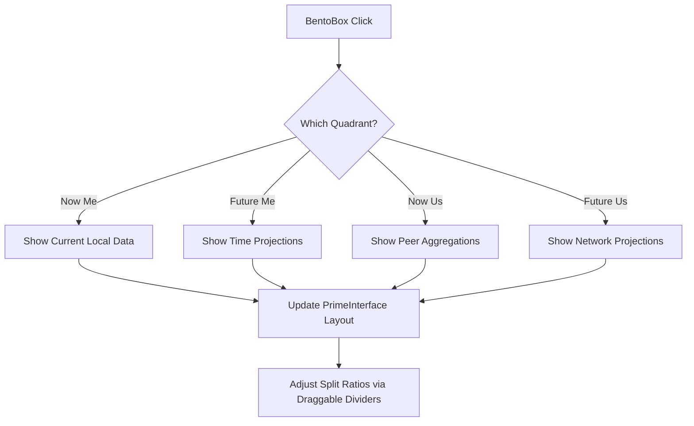

# BentoBox Implementation Plan

## Overview
The BentoBox is a 4-quadrant interface (Now Me, Future Me, Now Us, Future Us) that controls the main display of the `PrimeInterface`. It allows users to toggle between different temporal and social perspectives.

## Component: `BentoBox.vue`
- **Location**: [`src/components/orbit/parts/BentoBox.vue`](src/components/orbit/parts/BentoBox.vue)
- **State**:
  - `activeQuadrants`: Array of active IDs (e.g., `['now-me', 'future-me']`).
  - `focusedQuadrant`: The last clicked quadrant.
- **Visuals**:
  - 2x2 Grid.
  - Dynamic border color based on `focusedQuadrant`.
  - Opacity 0.4 for inactive, 1.0 for focused.

## Implementation Phases

### Phase 1: Top Row (Now Me & Future Me)
- **Focus**: Implement the horizontal split between the top-left (Now Me) and top-right (Future Me).
- **Replication**: Replicate the `PrimeInterface` instruments (heliClock, cueCube, etc.) from Now Me into the Future Me quadrant.
- **Divider**: Implement a draggable vertical divider to adjust the ratio between Now Me and Future Me.

### Phase 2: Bottom Row (Now Us & Future Us)
- **Focus**: Implement the bottom-left (Now Us) and bottom-right (Future Us) quadrants.
- **Replication**: Replicate the interface into these quadrants with aggregated peer data.
- **Divider**: Implement a draggable horizontal divider to adjust the ratio between the top and bottom rows.

## Data Mapping & World Awareness
- **Now Me**: Current local state (Orbit, Body, Earth).
- **Future Me**: Time-projected state (e.g., `resonancePulse` projections).
- **Now Us**: Aggregated peer/network data (e.g., average heart rate).
- **Future Us**: Projected network trends.

### World-Specific Demands
The BentoBox must be aware of the `activeWorld` (Orbit, Body, Earth) as each world has different data requirements:
- **Orbit**: Focus on temporal projections and personal/peer resonance.
- **Body**: Focus on physiological aggregations (e.g., average heart rate across peers).
- **Earth**: Focus on environmental and collective impact data.
- **Peer Scaling**: The number of peers/data points in the "Us" quadrants will scale based on the world context.

## Mermaid Workflow

