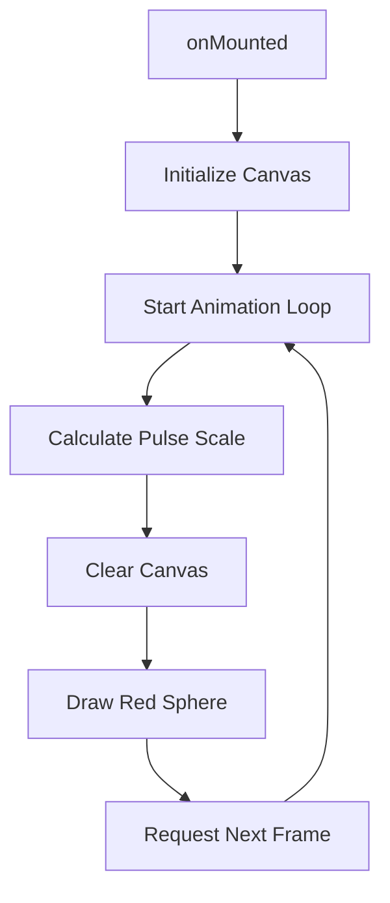

# Heart Animation Plan

## Objective
Create a pulsing red sphere representing a human heart in `src/components/orbit/worlds/body/organSurface.vue` using the HTML5 Canvas API.

## Technical Details
- **Canvas ID**: `besearch-world` (to match `Cues-BodyWorld.vue` methodology)
- **Shape**: Sphere (rendered as a 2D circle with a radial gradient for a 3D effect)
- **Color**: Red (`#ff0000` or similar)
- **Pulse Rate**: 72 BPM
  - 72 beats / 60 seconds = 1.2 beats per second
  - 1 / 1.2 = 0.833 seconds per beat (833ms)
- **Animation**: `requestAnimationFrame` for smooth pulsing.

## Implementation Steps
1.  **Template Update**:
    - Replace the placeholder `div` with a `canvas` element.
    - Keep the `biomarker-layer` wrapper for positioning.
2.  **Script Setup**:
    - Add `ref` for the canvas.
    - Implement an `initHeart` function to set up the canvas context and start the animation loop.
    - Use `onMounted` to trigger initialization.
    - Use `onUnmounted` to clean up the animation loop.
3.  **Animation Logic**:
    - Calculate scale based on `performance.now()` and the target BPM.
    - Draw a circle with a radial gradient.
    - Handle window resizing to keep the canvas sharp.

## Mermaid Diagram


## Proposed Code Structure for `organSurface.vue`
```javascript
const canvasRef = ref(null)
let animationId = null

const drawHeart = (ctx, width, height, time) => {
  const bpm = 72
  const bps = bpm / 60
  const period = 1000 / bps
  
  // Simple sine wave for pulsing
  const pulse = Math.sin((time / period) * Math.PI * 2) * 0.1 + 1.0
  
  const centerX = width / 2
  const centerY = height / 2
  const baseRadius = Math.min(width, height) * 0.3
  const radius = baseRadius * pulse

  ctx.clearRect(0, 0, width, height)
  
  // Radial gradient for 3D effect
  const gradient = ctx.createRadialGradient(
    centerX - radius * 0.3, centerY - radius * 0.3, radius * 0.1,
    centerX, centerY, radius
  )
  gradient.addColorStop(0, '#ff5555')
  gradient.addColorStop(1, '#aa0000')
  
  ctx.beginPath()
  ctx.arc(centerX, centerY, radius, 0, Math.PI * 2)
  ctx.fillStyle = gradient
  ctx.fill()
}
```
