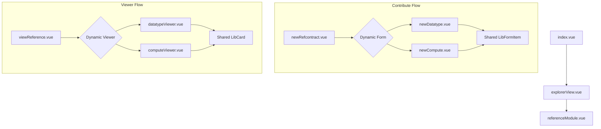

# Library Refactor Plan

## 1. Current State Analysis
The `src/components/library` section contains a large number of forms and viewers for "Reference Contracts". 

### Key Issues Identified:
- **Redundant Styling**: Every form component (e.g., `newDatatype.vue`, `newCompute.vue`) repeats similar CSS for grid layouts and labels.
- **Inconsistent Naming**: CSS classes like `.api-form-item`, `.question-form-item`, and `.compute-form-item` are used for identical purposes.
- **Manual State Binding**: Components are heavily coupled to `libraryStore` with repetitive `@input`/`@change` handlers that could be simplified.
- **Fragmented Viewers**: `viewReference.vue` uses a large `v-if/v-else` block to switch between viewer types, leading to a "God Component" that is hard to maintain.
- **Design Drift**: The UI uses basic HTML elements and custom CSS that doesn't fully leverage the newer `sovereign.css` design system (teals, golds, glassmorphism).

## 2. Proposed Architecture

### A. Shared Form Components
Create a set of "Base" components to handle common form patterns:
- `LibFormGroup.vue`: Handles the label/input grid layout and validation messages.
- `LibInput.vue` / `LibSelect.vue`: Styled wrappers around standard inputs using `sovereign.css` tokens.

### B. Layout Wrappers
- `LibSection.vue`: A wrapper for library sections with consistent headers and padding.
- `LibCard.vue`: A glassmorphism-style card for displaying contract details in the viewer.

### C. Refactored Viewer Strategy
- Move individual viewer logic (Question, Datatype, etc.) into dedicated small components.
- Use a dynamic component `<component :is="viewerComponent" />` in `viewReference.vue` to reduce template bloat.

## 3. UI/UX Enhancements (Sovereign Design)
- **Color Palette**: Transition from generic colors to `--sov-accent` (Teal) for primary actions and `--sov-gold` for highlights.
- **Typography**: Ensure consistent use of 'Inter' with proper weight scaling.
- **Interactions**: Add subtle transitions (`--sov-transition-med`) to buttons and form focus states.
- **Layout**: Use a more spacious, modern grid instead of the tight 1fr/2fr split.

## 4. Implementation Steps

### Phase 1: Foundation
1. Create `src/components/library/shared/` directory.
2. Implement `LibFormItem.vue` to standardize the label/input layout.
3. Implement `LibButton.vue` (or extend `.sov-button`) for consistent actions.

### Phase 2: Form Refactor
1. Update `newRefcontract.vue` to use the new shared components.
2. Refactor `newDatatype.vue`, `newQuestiontype.vue`, etc., to remove redundant `<style>` blocks and use `LibFormItem`.

### Phase 3: Viewer Refactor
1. Break down `viewReference.vue` into smaller, type-specific viewer components.
2. Apply "Sovereign" card styling to the viewer outputs.

### Phase 4: Cleanup
1. Remove unused CSS classes and consolidate styles into a single library-wide CSS file or shared utility classes.

---

## Mermaid Diagram: Proposed Component Flow

