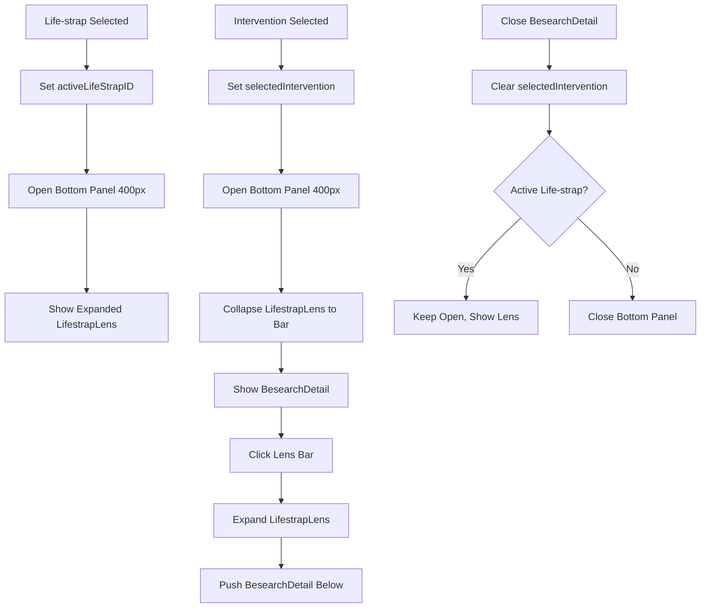

# Plan: Life-strap and Besearch Integration in Bottom Panel

This plan outlines the changes required to integrate Life-strap items and Besearch interventions within the bottom panel, ensuring correct expansion, collapsing, and closing behavior.

## 1. Life-strap Selection (`src/components/orbit/lifetools/LifeTools.vue`)
- Ensure `handleStrapSelect` correctly updates `storeAI.activeLifeStrapID`.
- Trigger bottom panel expansion by setting `storeBesearch.showBottomPanel = true` and `storeBesearch.bottomHeight = 400`.

## 2. Besearch Intervention Selection (`src/components/besearch/interventions/interventionType.vue`)
- When an intervention is selected, ensure `storeBesearch.showBesearchDetail` is set to `true`.
- The Life-strap lens should automatically collapse to a bar (handled by computed properties in `BottomPanel.vue`).

## 3. Bottom Panel Layout (`src/components/orbit/parts/BottomPanel.vue`)
- Update `isLensCollapsed` computed property:
  - Collapse if `storeBesearch.hasActiveIntervention` is true.
  - Collapse if no `storeAI.activeLifeStrapID` is present.
- Update template to show `lens-collapsed-bar` when `isLensCollapsed` is true.
- Ensure `LifestrapLens` is pushed below or above `besearch-detail` as required.
- Add `expandLens` method to allow manual expansion of the lens even when an intervention is active.

## 4. Closing Behavior (`src/components/besearch/interventions/besearchDetail.vue`)
- Update `closeCycleToolbar` to clear `storeBesearch.selectedIntervention`.
- This should trigger the bottom panel to close if no other active context (like an active Life-strap) exists.

## 5. Global State Coordination (`src/components/orbit/PrimeInterface.vue`)
- Review `isBottomOpen` and `bottomHeight` computed properties to ensure they respond correctly to both `activeLifeStrapID` and `hasActiveIntervention`.

## Mermaid Diagram: Bottom Panel State Flow

