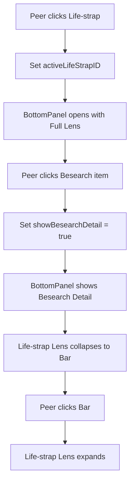

# Plan: Life-strap Lens Persistence in Bottom Panel

The goal is to ensure that when a peer clicks on a Besearch item after opening a Life-strap, the Life-strap lens remains accessible as a clickable bar rather than disappearing entirely.

## Current Behavior
1. Peer opens Life-strap -> Bottom panel opens, Life-strap lens is displayed.
2. Peer clicks Besearch item -> Besearch detail is shown, but Life-strap lens disappears.

## Proposed Solution
Modify [`src/components/orbit/parts/BottomPanel.vue`](src/components/orbit/parts/BottomPanel.vue) to:
1. Always show the `lens-section` if `storeAI.activeLifeStrapID` is present.
2. Force the lens into a `collapsed` state (the "bar") when `storeBesearch.showBesearchDetail` is true.
3. Allow the peer to click the bar to expand the lens (which might overlay or push the Besearch detail).

## Implementation Steps

### 1. Analyze and Update `BottomPanel.vue`
- Ensure the `v-show` or `v-if` on the content container includes `storeAI.activeLifeStrapID`.
- Refine the `isLensCollapsed` logic to automatically collapse when Besearch detail is active, but stay visible as a bar.
- Add styling for the `lens-collapsed-bar` to ensure it looks like a proper "bar" that can be clicked.

### 2. State Management
- Verify that `storeAI.activeLifeStrapID` is not cleared when a Besearch item is selected.
- Ensure `storeBesearch.showBesearchDetail` correctly triggers the UI shift.

## Mermaid Diagram

## Todo List
- [x] Analyze BottomPanel.vue logic for lens visibility and collapse states
- [ ] Modify BottomPanel.vue to ensure Life-strap Lens bar is visible when Besearch detail is active
- [ ] Implement toggle logic for the Life-strap Lens bar in BottomPanel.vue
- [ ] Verify state management in aiInterfaceStore and besearchStore for active items
- [ ] Test the transition from Life-strap selection to Besearch item selection
