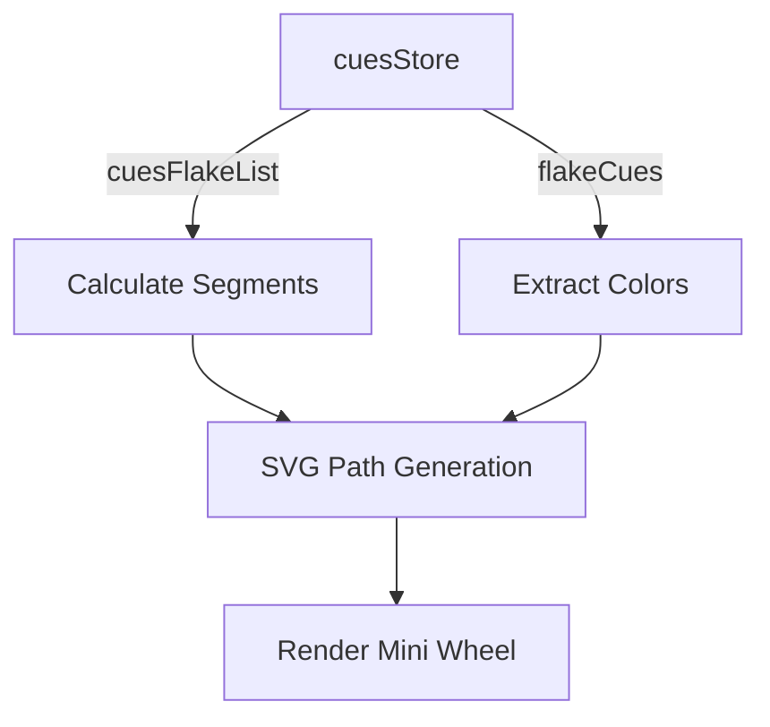

# Plan: Mini Whole Wheel Implementation

The goal is to create a mini version of the `wholeResonance.vue` wheel in `minWhole.vue`. This mini wheel will aggregate `resonancePulse` (represented by the cues in `cuesStore`) into a simple SVG-based segmented circle.

## Data Source
- `cuesStore.cuesFlakeList`: Provides the segments (branches).
- `cuesStore.flakeCues`: Provides the status/colors for each segment.

## Implementation Strategy
1. **SVG Pie Chart**: Use a simple SVG with `<path>` elements for each segment.
2. **Calculations**:
   - Each segment will have an equal angle: `360 / cuesFlakeList.length`.
   - The color of each segment will be derived from the first available `cuecolor` in `flakeCues[segment.cue]`.
3. **Interactivity**: Keep it simple for now (no complex hover/click logic as requested).

## Proposed Component Structure (`minWhole.vue`)

```vue
<template>
  <div class="min-whole">
    <svg viewBox="0 0 100 100" class="mini-wheel">
      <path
        v-for="(seg, index) in segments"
        :key="index"
        :d="describeArc(50, 50, 45, index * angle, (index + 1) * angle)"
        :fill="seg.color"
        stroke="white"
        stroke-width="0.5"
      />
      <circle cx="50" cy="50" r="15" fill="white" />
    </svg>
  </div>
</template>

<script setup>
import { computed } from 'vue'
import { cuesStore } from '@/stores/cuesStore.js'

const storeCues = cuesStore()

const segments = computed(() => {
  const list = storeCues.cuesFlakeList
  const status = storeCues.flakeCues
  
  return list.map(item => {
    const cueStatus = status[item.cue] || []
    const color = cueStatus.length > 0 ? cueStatus[0].cuecolor : '#e0e0e0'
    return { ...item, color }
  })
})

const angle = computed(() => {
  return segments.value.length > 0 ? 360 / segments.value.length : 0
})

// SVG Arc helper
function polarToCartesian(centerX, centerY, radius, angleInDegrees) {
  const angleInRadians = (angleInDegrees - 90) * Math.PI / 180.0;
  return {
    x: centerX + (radius * Math.cos(angleInRadians)),
    y: centerY + (radius * Math.sin(angleInRadians))
  };
}

function describeArc(x, y, radius, startAngle, endAngle) {
  const start = polarToCartesian(x, y, radius, endAngle);
  const end = polarToCartesian(x, y, radius, startAngle);
  const largeArcFlag = endAngle - startAngle <= 180 ? "0" : "1";
  return [
    "M", x, y,
    "L", start.x, start.y,
    "A", radius, radius, 0, largeArcFlag, 0, end.x, end.y,
    "Z"
  ].join(" ");
}
</script>

<style scoped>
.min-whole {
  width: 100px;
  height: 100px;
}
.mini-wheel {
  width: 100%;
  height: 100%;
}
</style>
```

## Mermaid Diagram


