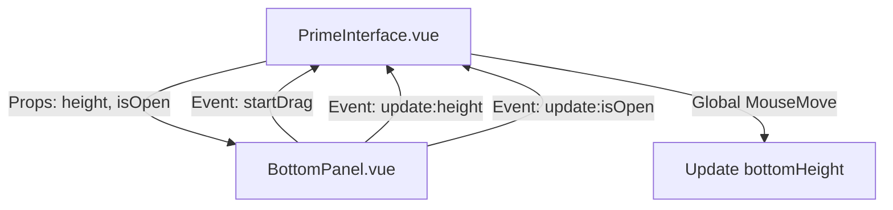

# Bottom Panel Implementation Plan

This plan outlines the steps to make the `BottomPanel` draggable and toggleable, matching the behavior of the left and right panels in the Orbit interface.

## Proposed Changes

### 1. PrimeInterface.vue
- **State**:
  - `bottomHeight`: ref (default ~60px or 0)
  - `isBottomOpen`: ref (boolean)
- **Logic**:
  - `startBottomDrag`: Method to set `draggingMode = 'bottom'`.
  - `handleGlobalDrag`: Add logic to update `bottomHeight` based on `window.innerHeight - e.clientY`.
- **Template**:
  - Pass `height` and `isOpen` props to `<BottomPanel />`.
  - Listen for `@update:height`, `@update:isOpen`, and `@startDrag`.

### 2. BottomPanel.vue
- **Props**: `height`, `isOpen`.
- **UI**:
  - Add a toggle/drag button (e.g., a horizontal bar or bubble).
  - Use `v-show` or height-based transitions for content.
- **Events**: Emit `startDrag` on mousedown, `update:isOpen` and `update:height` on click.

## Mermaid Diagram

## Todo List
- [ ] Define state variables for BottomPanel in PrimeInterface.vue
- [ ] Update PrimeInterface.vue template and drag handlers
- [ ] Update BottomPanel.vue with toggle button and emits
- [ ] Style BottomPanel for absolute positioning and resizing
