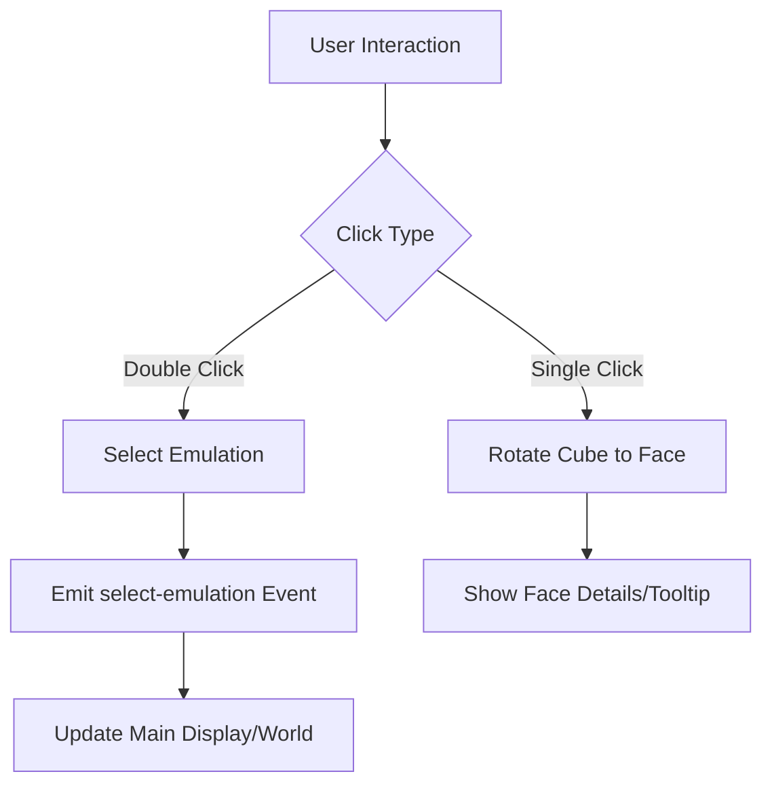

# Plan: 3D Breadcrumb Cube Navigation

## Overview
Implementation of a 3D navigation tool (`cubeStructure.vue`) that acts as a breadcrumb system for emulations. The cube will display different emulation states on its faces and allow users to interact with them to switch the main display.

## Proposed Architecture

### 1. Data Structure (Mock)
The cube will represent a path through emulations. Each face of the cube will map to an emulation state:
- **Face 1 (Front):** Heart Emulation (e.g., pulse, rhythm)
- **Face 2 (Right):** River Emulation (e.g., flow, current)
- **Face 3 (Top):** Bentobox Rainfall Data (e.g., precipitation levels)
- **Face 4 (Left):** [Placeholder for next path element]
- **Face 5 (Bottom):** [Placeholder for previous path element]
- **Face 6 (Back):** [Placeholder for history/root]

### 2. Component Structure (`cubeStructure.vue`)
- **Template:** A container `div` for the Three.js canvas.
- **Script:**
    - Use `THREE.BoxGeometry` for the cube.
    - Use `THREE.MeshStandardMaterial` with textures (or colors/labels for now) for each face.
    - `Raycaster` for detecting clicks on specific faces.
    - `GSAP` (if available) or `requestAnimationFrame` for smooth rotations.
- **Styles:** Scoped CSS for the container, ensuring it fits within the Orbit HUD or Prime Interface.

### 3. Interaction Logic
- **Single Click:** Rotate the cube to show the clicked face prominently.
- **Double Click:** 
    - Trigger a "mini slide show" (auto-rotation or expanded view).
    - Emit an event (e.g., `@select-emulation`) to update the main application display to the selected emulation.
- **Hover:** Highlight the face or show a tooltip with the emulation name.

## Implementation Steps

### Phase 1: Setup & Basic Cube
- [ ] Initialize Three.js scene, camera, and renderer in `onMounted`.
- [ ] Create a basic cube with different colors for each face.
- [ ] Implement basic auto-rotation or drag-to-rotate.

### Phase 2: Mock Content & Textures
- [ ] Create labels/textures for "Heart", "River", and "Rainfall".
- [ ] Map these textures to specific faces of the cube.

### Phase 3: Interaction & Navigation
- [ ] Implement `Raycaster` to identify which face is clicked.
- [ ] Add logic for single-click rotation to face.
- [ ] Add logic for double-click selection and event emission.

### Phase 4: Integration
- [ ] Integrate `cubeStructure.vue` into `PrimeInterface.vue` or a relevant HUD component.
- [ ] Connect the `@select-emulation` event to the application's world-switching logic.

## Mermaid Diagram

