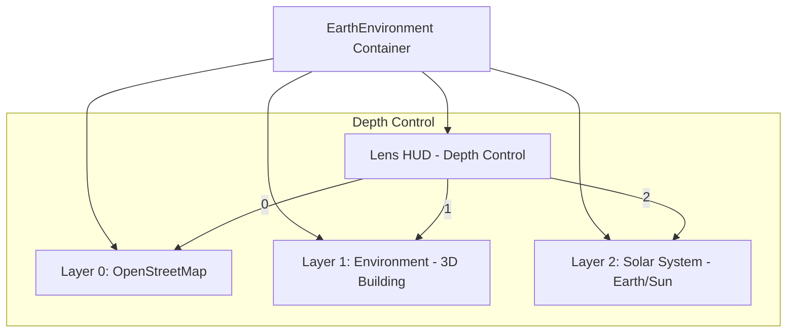

# Implementation Plan - Earth Environment Layers

This plan outlines the changes required to implement the layered depth system in [`EarthEnvironment.vue`](src/components/orbit/worlds/EarthEnvironment.vue), following the pattern used in [`Cues-BodyWorld.vue`](src/components/orbit/worlds/Cues-BodyWorld.vue).

## 1. Depth Level Redefinition
The `zoomDepth` (0-2) will be mapped to the following labels:
- **0: SURFACE** (Existing OpenStreetMap view)
- **1: ENVIRONMENT** (New layer for 3D building drawing)
- **2: SOLAR SYSTEM** (New layer for Earth-Sun relationship)

## 2. Template Changes
We will introduce conditional layers using `v-if="zoomDepth === X"`:

### Depth 1: ENVIRONMENT
- A container for drawing 3D buildings.
- Will include a placeholder or a dedicated component if available.
- CSS will handle the "portal" look, likely with a dark background and centered content.

### Depth 2: SOLAR SYSTEM
- A visualization of Earth in relation to the Sun.
- Placeholder for now, similar to the cellular layer in BodyWorld.

## 3. Script Changes
- Update `depthName` computed property.
- Ensure `useLensStability` is correctly managing `zoomDepth`.
- Add any necessary refs for the new layers.

## 4. Style Changes
- Add `.depth-layer`, `.environment-layer`, and `.solar-system-layer` classes.
- Ensure layers are centered and have appropriate z-index to appear within the lens or as overlays.

## Mermaid Diagram of Layers



## Proposed Component Structure
```html
<!-- Layer 1: Environment -->
<div v-if="zoomDepth === 1" class="depth-layer environment-layer">
  <div class="building-placeholder">
    3D Building Drawing Area
  </div>
</div>

<!-- Layer 2: Solar System -->
<div v-if="zoomDepth === 2" class="depth-layer solar-system-layer">
  <div class="solar-placeholder">
    Earth & Sun Relationship
  </div>
</div>
```
