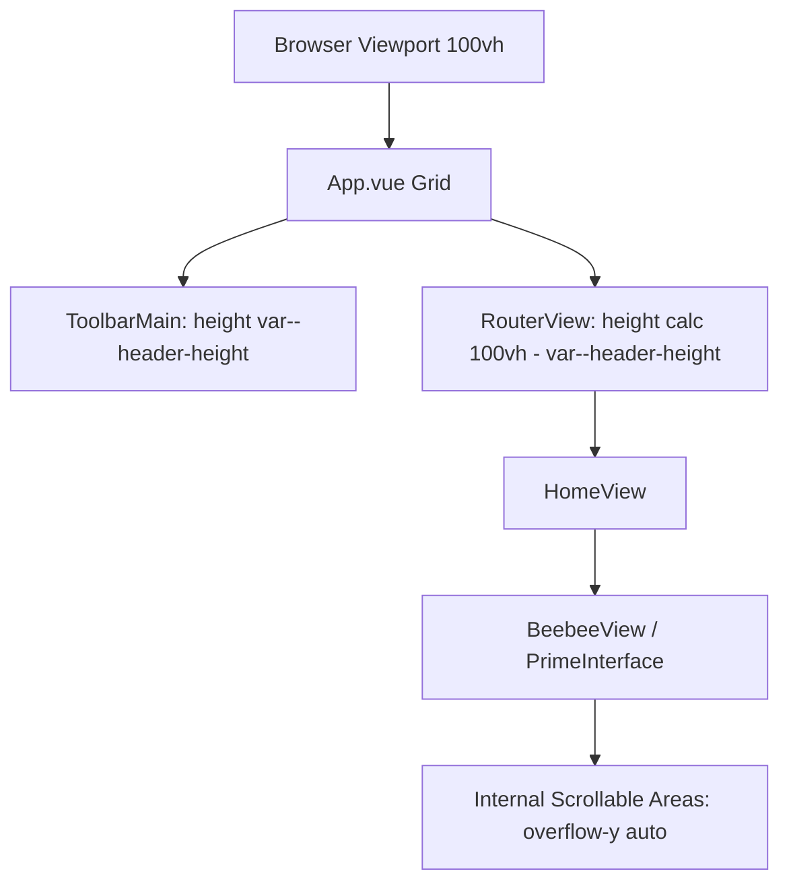

# Plan: Full Screen No-Scroll Implementation

The goal is to ensure the BentoBoxDS app occupies exactly one full display screen with no scrolling, accounting for the header height.

## Analysis
- `src/App.vue` currently renders `<toolbar-main>` and `<router-view>` as siblings.
- `ToolbarMain` has `position: fixed` in some media queries but also contributes to height in others.
- `BeebeeView.vue` and `PrimeInterface.vue` both use `height: 100vh`, which when combined with a header, causes overflow.
- `src/assets/main.css` adds padding to `#app`, further contributing to overflow.

## CSS GRID  ONLY PROJECT

## Proposed Changes

### 1. Global Styles (`src/assets/main.css`)
- Remove padding from `#app`.
- Ensure `html, body, #app` are strictly `100vh` and `overflow: hidden`.

### 2. Root Layout (`src/App.vue`)
- Implement a CSS Grid on the root element to manage the header and content areas.
- Define a CSS variable `--header-height` (e.g., `60px`) to be used across the app.

### 3. Header (`src/components/toolbars/mainTools.vue`)
- Standardize the header height to match `--header-height`.
- Remove `position: fixed` to allow it to sit naturally in the grid, or adjust its container.

### 4. View Components (`BeebeeView.vue`, `PrimeInterface.vue`)
- Change `height: 100vh` to `height: calc(100vh - var(--header-height))`.
- Ensure internal containers use `overflow-y: auto` where scrolling is actually needed (like chat history), while the main container remains fixed.

## Mermaid Diagram

## Next Steps
1. Update `src/App.vue` to use a grid layout.
2. Update `src/assets/main.css` to remove padding and enforce height.
3. Adjust `BeebeeView.vue` and `PrimeInterface.vue` to use calculated heights.
